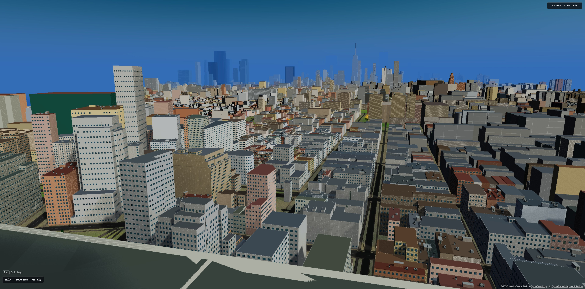
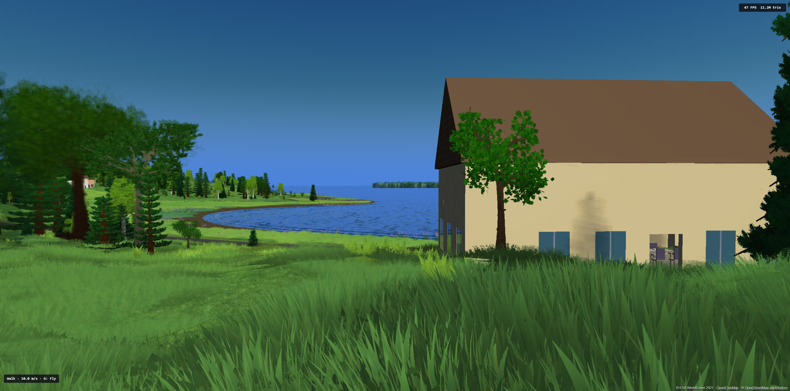
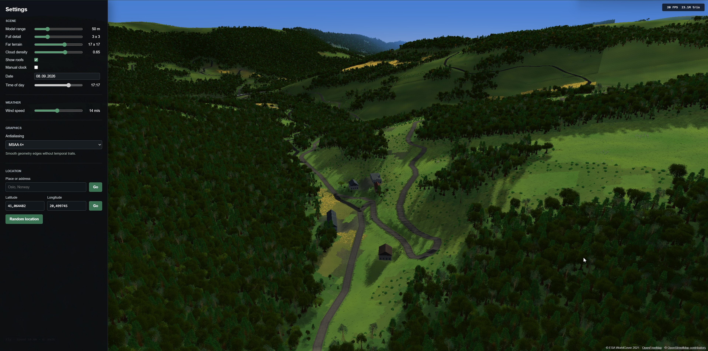
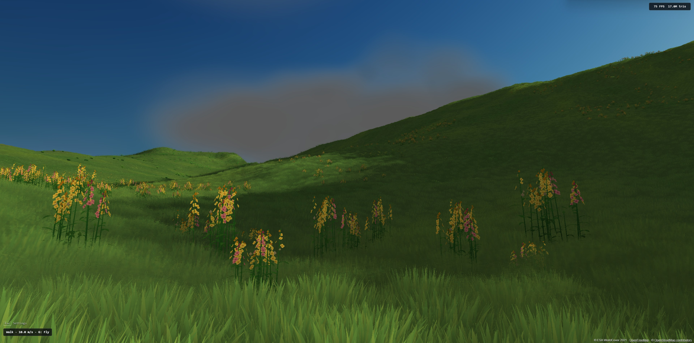

# Earth

A walkable, streamed 3D Earth built with Babylon.js and real-world geographic data.
Fly across terrain, drop to ground level, and explore a changing procedural landscape
of roads, buildings, water, vegetation, weather, seasons, stars, and a fictional moon.


## Highlights

- Streams real-world elevation, Copernicus LCM-10, and OpenStreetMap data around you.
- Generates terrain, roads, buildings, enterable interiors, and regional vegetation.
- Simulates sunlight, seasons, snow, wind, clouds, stars, and moonlight.
- Supports free flight and collision-aware walking, with saved position and settings.

## Quick Start

Requires Node.js 22.5 or newer and Corepack.

```bash
git clone git@github.com:magnificus/earth.git
cd earth
corepack enable
yarn install
yarn dev
```

Open [localhost:3000](http://localhost:3000). Press `Escape` to open settings,
search for a place, or jump to a random land location. Position and settings
are saved locally; the backend is optional.

Click the world to look around with the mouse. Move with `W` / `A` / `S` / `D`,
use `Q` / `E` to fly down or up, and scroll to change flight speed.
Press `G` to switch between flying and walking, `Space` to jump,
and `F` to open doors.

### Land Cover

Copernicus LCFM LCM-10 V1 (reference year 2020) supplies land cover for terrain
colours, coastlines and vegetation placement. It is the sole source; no URL
switch or API key is needed.

The app streams native-resolution classification windows from Terrascope's
public TiTiler service, using nearest-neighbour sampling and translation of the
class codes. Catalogue checks are cached per source item, avoiding raster requests
for absent ocean tiles. Random navigation requires a known land class and positive
elevation, skipping absent, masked and unclassifiable coverage. Other service errors
remain visible. Rendering uses a bare-ground fallback where classification is missing.
Coverage is 60 S to 83 N. Dataset and attribution:
<https://stac.terrascope.be/collections/lcfm-lcm-10>.

## Documentation

- [User guide](docs/user-guide.md): controls, places to explore, graphics, settings, and server saves.
- [Development](docs/development.md): scripts, builds, deployment, code checks, and project structure.
- [Performance and diagnostics](docs/performance.md): render reports, building captures, and browser tests.
- [Rendering and world generation](docs/rendering.md): vegetation, impostors, weather, and streaming.
- [Customization](docs/customization.md): terrain materials, building interiors, and road plans.

## Screenshots









## License

MIT
