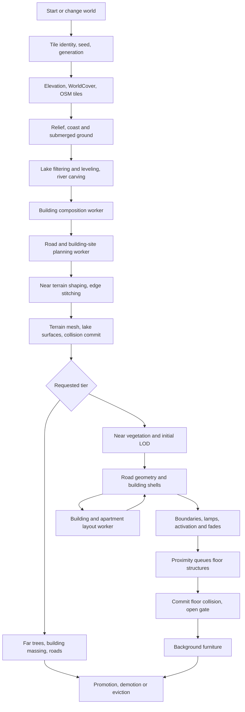

# Generation architecture review

Reviewed against the working tree on 2026-09-20. Scope: runtime world generation,
including terrain, map features, vegetation, building shells, interiors, scheduling,
LOD transitions, caching, and disposal. This is an architecture and code review,
not a new browser performance measurement. Application code was not changed by this
review. Concurrent edits appeared in the building compiler, river crossings, terrain
surface colors, and a renderer test while the review ran; those edits were preserved.
Source line references are navigation starting points and can shift with those edits.

## Findings, in priority order

### 1. High: retrying a partial detail build loses ownership of completed fields

Evidence: `src/app/Game.ts:550`, `:1128`, `:1148`, `:1384`.

`streamTile` catches a detail-build error and deliberately leaves finished vegetation
visible. `record.detailed` remains false, so the scheduler retries the detail build.
However, `buildTileDetail` starts the entire field sequence again, and
`stageTileField` assigns `record[kind] = field` without disposing or reusing the old
field. The rock assignment has the same problem.

For example, if map-feature construction fails after the vegetation succeeds, the
next attempt replaces all vegetation references. The old roots remain in the scene,
but tile disposal only knows about the replacement roots. Repeated failures can
accumulate duplicate geometry, instance buffers, and retained asset leases.

This breaks the otherwise strong rule that a streamed tile owns every resource it
creates. Resume completed stages, or hold each replacement in an explicitly owned
temporary generation and dispose the old resources only on successful commit.
Add a failure-then-retry test that checks scene resource counts after eviction.

### 2. High: cleanup does not cover the whole multi-stage construction operation

Evidence: `src/app/Game.ts:833`, `:855`, `:942`, `:1153`, `:1161`;
`src/world/OpenStreetMap.ts:264`, `:291`, `:300`.

There are good local cleanup blocks, but the outer ownership boundaries are incomplete:

- After terrain mesh creation, an exception from lake-layer construction leaves the
  terrain mesh outside a committed tile. The outer `finally` releases shared elevation
  ownership, not that mesh. The explicit stale-generation cleanup only runs if the
  awaited call returns successfully.
- After `OpenStreetMap.createLayer` succeeds, a failure while constructing plot
  boundaries or lamps leaves the completed map root unowned by `record.mapFeatures`.
- Within `createLayer`, planned-road construction and building construction have
  catches, but subsequent bridge/river construction, clearance, and merges do not
  share one encompassing cleanup block. Source collection before the first `try`
  can also leave the newly created root behind if it throws.

These are exception-path defects established by control-flow inspection; they are
not a claim that ordinary successful generation leaks. A stage should own every
allocation until ownership is transferred, with one failure cleanup path covering
all remaining work. Dispose through the domain helpers so shared materials survive.

### 3. Medium: a transient map failure becomes persistent empty map data

Evidence: `src/app/Game.ts:596`, `:611`, `:1357`, `:1362`;
`src/world/OpenStreetMap.ts:224`; `src/core/ResourceCache.ts:43`.

The underlying resource cache evicts rejected requests, which permits retry.
But `requestMapTiles` catches the failure and resolves to `[]`; that promise is then
stored on the streamed tile. `loadMapTiles`, terrain promotion, and scenery rebuilds
reuse it. One failed provider request also rejects the whole `Promise.all`, losing
the successful tiles from that particular aggregate result.

The fallback keeps the world usable, but a temporary outage can leave roads,
buildings, OSM land cover, and mapped water absent for the tile's remaining lifetime.
There is no distinction between valid empty data and a failed download.

Represent degraded data explicitly and retry with backoff. Recovery must rebuild
the affected terrain/water/site plan as well as the visible map layer.

### 4. Medium: scenery invalidation violates replacement-before-disposal

Evidence: `src/app/Game.ts:538`, `:1835`, `:1843`.

Normal promotion and demotion preserve an old representation until the new one is
ready. Date/roof invalidation does not: `streamTile` immediately disposes detailed
scenery, far trees, and far buildings when it sees a new scenery revision, before
building replacements. Its terrain and far roads can remain, but completed near
buildings, vegetation, interiors, and their collision geometry are removed.

This also contradicts the comment on `invalidateScenery` claiming visible tiles are
retained until replacements are ready. A roof-only edit triggers vegetation rebuilds
and resets all four planning workers even though the vegetation and geographic
plans did not change.

Use separate revisions for affected layers and commit replacement scenery before
disposing the previous version. The first priority is correct ownership, followed
by narrower invalidation.

### 5. Medium: mapped street-lamp support is not connected to runtime input

Evidence: `src/world/OpenStreetMap.ts:401`, `:433`;
`src/roads/RoadPlanningTask.ts:11`, `:27`;
`src/roads/RoadAndBuildingPlanner.ts:191`, `:466`.

The planner accepts mapped lamps, and the worker forwards `input.lamps`. But the
live adapter returns only roads, buildings, and options. There is no mapped-lamp
extraction in the runtime source. Consequently runtime lamps are procedural infill;
the mapped-lamp branch is exercised by synthetic planner inputs, not by live maps.

Either connect an available provider layer to this input or document it as planner
capability only. Do not assume the current provider exposes lamp nodes without
checking its data. The README currently overstates the live mapped-lamp behavior.

## Overall structure

The central design is sound: geography becomes plain plans; plans shape terrain;
renderers turn those decisions into scene resources; proximity adds expensive
detail. The largest weaknesses are ownership across asynchronous stages and overly
broad scheduling/invalidation boundaries, rather than the geometry algorithms.



The apparent loop between shells and layout is a staged handshake, not recursive
generation: the shell compiler pauses for a plain layout result and then continues.
Interior geometry is lazy; much of the interior *planning* happens before the shell
can be completed because it determines stairs, entrances, and facade openings.

## Step-by-step walkthrough and verdicts

### 1. Bootstrap and establish the world

`src/index.ts:16`, `src/app/Game.ts:374`, `:468`.

The entry point chooses the rendering engine, creates `Game`, and awaits
initialization. Game creates camera/controls, restores the player's location,
sets up solar lighting and the date, then starts the world. A world change increments
the streaming generation, resets workers, clears old tiles and shared elevations,
and resets the geographic frame.

The center tile is built at native detail and anchors the camera. Only that tile
gates spawn; the surrounding window streams later. Scene readiness runs before the
loading screen is dismissed and the ordinary render loop starts.

**Verdict:** sensible. The full center-tile vegetation and map compilation are still
on startup's critical path. The comment at `Game.ts:426` about waiting for the entire
inner window is stale. A fast spawn policy would require a separate readiness
definition; it is not just a matter of making more calls parallel.

### 2. Choose tile identity, coordinates, and deterministic seeds

`src/world/WorldGrid.ts:5`, `src/app/Game.ts:589`.

The application owns a level-17 grid independently of provider zooms. Tile location
and world seed derive stable generation inputs. The first terrain tile establishes
meters per scene unit and a stable geographic frame; later tiles receive offsets
within that frame. Building ownership selects one stable tile for a cross-boundary
building, while terrain/exclusion plans can include its portions on neighboring tiles.

**Verdict:** good separation. A provider tile, application tile, local planner frame,
and scene coordinate are intentionally different things. Preserve explicit unit
conversion rather than trying to collapse these representations.

### 3. Fetch source data and resample terrain

`src/app/Game.ts:594`, `src/terrain/TerrainElevationSource.ts`,
`src/world/WorldCover.ts`, `src/world/OpenStreetMap.ts:219`.

OSM requests begin alongside elevation loading. Terrarium PNGs are decoded to
elevations and sampled into the application area. Native detail upsamples the
height field; far terrain uses a coarser rendered grid. WorldCover and wider lake
context are then requested. OSM land-cover polygons refine the raster classification.

**Verdict:** good use of overlapping independent I/O and reusable decoded data.
Upsampling supplies vertices for later procedural relief; it does not manufacture
new measured elevation. Map failure handling needs the recovery policy in finding 3.

### 4. Add relief, then shape water-bearing terrain

`src/app/Game.ts:629`, `:644`, `:701`, `:739`, `:759`.

Deterministic relief uses slope, land cover, and world seed. A pre-carving elevation
copy is retained. WorldCover constrains elevations, or the fallback sinks submerged
terrain. Lake candidates are prepared both for the tile surface and a larger context.
The lake worker filters context candidates against obstacles; accepted identities
select the corresponding clipped surface polygons. Lakes are leveled/carved using
shared lake elevations, followed by waterway carving.

**Verdict:** the order makes sense: add natural variation before applying engineered
or water-level constraints. Wider context prevents tile-local lake decisions from
disagreeing unnecessarily. Separate accepted context geometry and clipped render
geometry are intentional, not redundant planning. Later road and edge operations
can still alter support, which is why lake-support diagnostics occur again.

### 5. Compose buildings and plan the shared site

`src/world/OpenStreetMap.ts:439`, `:890`,
`src/buildings/CompositeBuildings.ts:35`, `src/roads/RoadAndBuildingPlanner.ts:187`.

Provider building features are normalized, with use inferred from explicit tags,
recognized POIs, then land-use context. Composition merges overlapping compatible
parts and retains height bands, courtyards, and differing vertical extents.
Composition is cached by provider-data identity and runs in its own worker on the
normal Game path.

Projected roads and composed footprints go to the road/site worker. It constructs
road networks, triangulates and partitions road surfaces by physical layer, merges
compatible pieces, optionally builds shoulders, clips building sites, then creates
lamps, plots, and selected plot boundaries.

**Verdict:** correct to compose before assigning render ownership or planning interiors.
The shared site plan is a strong architectural choice. Far plans omit shoulders but
still calculate plots, lamps, and boundaries that far layers do not render; a smaller
far planning contract is a possible optimization, subject to profiling.

### 6. Conform terrain to the plan, stitch, then commit ground and water

`src/terrain/PlannedFeatureTerrain.ts:47`, `src/terrain/TerrainStitching.ts:14`,
`src/app/Game.ts:800`, `:831`, `:855`.

For native terrain, the code samples road grades from an unchanged terrain copy,
levels building pads, and applies road shaping. Shared building elevations coordinate
cross-tile pads. Final elevation edges are stitched, then terrain mesh, textures,
normals, skirts, collisions, and lake surfaces are constructed. Shorelines follow
the rendered mesh. The new terrain/lake pair replaces the previous pair only after
both are ready. Matching far stand-ins survive promotion until detail replaces them.

**Verdict:** correct dependency order and good successful-path replacement semantics.
Far tiles deliberately skip native site shaping. Edge heights use the first retained
value at a shared sample, so continuity is prioritized over strict load-order
independence. Seeded generation alone therefore does not establish complete
order-independent world reproducibility. This is a tradeoff to test, not proof of
a currently visible crack. Exception cleanup needs finding 2.

### 7. Generate and activate near vegetation

`src/app/Game.ts:985`, `:1050`, `:1128`, `:1409`,
`src/vegetation/TreeField.ts:728`, `src/vegetation/VegetationField.ts:79`.

The tile constructs road/building exclusions and planned-boundary exclusions.
Geographic actor mix, per-layer seeds, regional variants, date, and snow configure
trees, saplings, grass, tall plants, wheat, bushes, ferns, beach stones, and rocks.
The fields are generated sequentially, with initial LOD prepared before staging.

Within the tree path, placement cells use stable per-cell randomness, land cover,
forest-edge distances, species distribution, and terrain/exclusion checks. Only
encountered variants acquire models/impostors. Model and atlas caches reuse assets;
thin-instance buffers supply placements. Other vegetation families use the shared
field/LOD interfaces with family-specific placement and appearance.

Fields activate across render opportunities, then fade against far trees. Shadows
and LOD are refreshed after activation.

**Verdict:** deterministic placement, demand-driven variants, asset leases, and a
common field contract make sense. However, all of these fields precede nearby
building/road commitment. Buildings do not depend on finished vegetation; both
depend on the plan. The serial order is a scheduling policy, not a geometric
requirement. It can delay useful streets and collision while decorative fields load.

### 8. Compile and publish map features

`src/world/OpenStreetMap.ts:235`, `:732`, `src/app/Game.ts:1153`.

The mixed map layer builds planned road/shoulder meshes, detailed buildings, bridge
geometry, river surfaces, river-clearance corrections, and material-specific merges.
Buildings are chunked by a vertex budget. Plot boundaries and street lamps are added
by Game, parented under the map root, positioned, and activated. Far buildings and
roads fade away only when the replacement map layer is ready.

**Verdict:** batching and staged placement are appropriate. The whole map root remains
the publication boundary, so completed roads/building chunks wait for the rest of
the tile. Publishing coherent smaller units could reduce perceived latency.
Bridges legitimately have a distinct vertical-geometry path; they should not be
treated like ground decals. Full-operation cleanup is inconsistent, as noted above.

### 9. Plan and compile each detailed building

`src/buildings/BuildingPlanner.ts`, `src/procedural/BuildingRendererCompiler.ts:182`,
`:204`, `:1138`, `src/buildings/BuildingPlanningTask.ts:17`.

Semantic planning resolves footprint, class/use, heights, levels, roof hints,
appearance inputs, and deterministic detail seed. The compiler samples the footprint
against terrain, determines base elevation, selects appearance/roof geometry,
detects shared facades, and branches to ordinary or complex geometry.

For an ordinary room-based building the chain is:

1. Select profile, floor count, story height, entrance edge, and doorway.
2. Ask the building-layout worker for apartment shells, circulation, and stair core.
3. Resolve stair flights; fall back to an open layout if the planned core is unusable.
4. Place facade windows using the returned shell boundaries and shared-wall exclusions.
5. Ask the apartment-layout worker to subdivide suitable units around those openings.
6. Emit facade, foundation, roof, equipment, and deferred interior descriptors.
7. Compact/merge geometry, configure materials, shadows, windows, and lazy interiors.

The building planner works in a local oriented meter frame. Small unconstrained
footprints up to 120 square meters remain one shell; larger ones receive circulation
and apartment subdivision. Apartment planning uses matching axes, area/width limits,
door/window constraints, room assignment, and internal doors. Layout caches are
bounded and return caller-owned copies. Nonresidential apartment contents can stay
open rather than receiving residential room subdivision.

Complex buildings divide height bands into floor sections, preserve holes and
overhangs, find overlapping stair connections, reserve circulation, and plan layouts
for those constrained sections. They reuse common facade, content, and merge helpers.

**Verdict:** the entrance -> circulation -> windows -> rooms dependency is sensible.
It explains why lazy interior geometry still needs eager layout planning. The
compiler nevertheless owns substantial domain policy as well as Babylon geometry;
it is not a pure renderer of one complete building plan. A plain compiled-building
plan would make those decisions easier to inspect, cache, and test independently.

### 10. Stream usable floor structures, then furniture

`src/procedural/BuildingRendererCompiler.ts:2616`,
`src/procedural/InteriorStreaming.ts:6`, `:75`, `:155`.

After map activation, residency checks run after rendering, normally every 120 ms.
They consider horizontal proximity plus floor height. Floors load within 18 meters
and unload beyond 27 meters, with additional vertical margins. A scene-wide queue
chooses structural work before background furniture and prioritizes nearby floors,
with focus hysteresis to avoid unnecessary switching.

Each frame advances generator steps under a 2 ms cooperative budget, with a
256-step emergency ceiling. Geometry is compacted and merged in bounded batches.
A whole floor structure commits before its gate opens and its collision becomes
usable; furniture then builds separately as background work. Window transparency
follows loaded floor residency. Leaving range cancels/requeues work or unloads
completed floors. Disposing an exterior removes its observers, gates, and interiors.

**Verdict:** a strong design, especially structure-before-furniture and floor residency.
The budget cannot interrupt an individual expensive step. Exterior construction now
gives urgent structures at most two frame opportunities per yield and proceeds if
rendering is stopped. The old note's eight-step limit and unlimited exterior wait
do not describe the current implementation.

### 11. Schedule movement, far layers, promotion, and eviction

`src/app/Game.ts:2130`, `:2207`, `:1704`.

The camera defines circular terrain/detail windows. Work is ordered by pending
demotion, detail, missing far terrain, then distance. Detail builds run alone; far
builds overlap up to two at once. Far terrain commits independently of its later
trees/building/road stand-ins. Detail expires after a 10-second cooldown, but demotion
waits for all stand-ins. Whole tiles expire after 30 seconds outside the needed
window, with an additional retained-tile cap. Active builds are protected from eviction.

**Verdict:** coherent memory/visibility policy with hysteresis. There is an important
tradeoff: one long detail build blocks all new tile builds, including missing ground.
The code's terrain-first policy applies within its far-work ordering, not globally.
Separate download/planning capacity from scene-commit capacity if route measurements
show this blocking useful progress. More concurrent mesh creation by itself could
worsen frame time and memory pressure.

## Patterns followed and exceptions worth keeping explicit

| Pattern | Where it works | Exception or concern |
| --- | --- | --- |
| Plain domain input -> worker -> plain output | Lake, composition, road/site, building/apartment tasks | Semantic facade and stair policy still lives in the renderer compiler. |
| One worker transport contract | Lazy dedicated worker, bounded FIFO, timeout, reset, diagnostics adapter | Runtime callers must still reject stale results and own partially built resources. |
| One horizontal plan shared by terrain and rendering | Building sites and planned road polygons | Vegetation road masks re-project source centerlines; bridges use a separate compiler. |
| Resource owner disposes what it allocates | StreamedTile, atlas leases, scene-owned materials | Partial retries and exceptions can lose ownership before commit. |
| Old layer stays until replacement is ready | Terrain promotion, far/near fades, demotion | Scenery revision changes dispose first. |
| Stable seeds and geographic identities | Tile/layer/cell seeds, building ownership, regional variants | Shared elevation choices also depend on which live tile establishes a value first. |
| Cooperative work | Streaming yielder, geometry generators, atlas captures | Separate streaming, interior, and GPU capture budgets are not one global frame cap. |
| Shared implementation for sync and async compilation | Both drive the same building generator | Startup also changes several scheduling policies based on whether a progress callback exists. |
| Cached failure can be retried | ResourceCache rejection eviction; failed composition clears pending work | Game converts map failures into cached successful emptiness. |

Road vegetation masks intentionally allow extra clearance, so they need not exactly
equal the rendered polygons. Still, their independent interpretation should have
tests for intersections, bridges, shoulders, and clipped tile edges. Document the
allowed difference rather than treating both as the same plan.

The sync building entry point is an explicit alternative used by tools/tests and
callers without a worker. It is not an implicit retry of a failed worker. That is
consistent with the documented no-main-thread-fallback rule.

`onProgress` currently doubles as a construction mode: it changes cooperative
yielding, initial visibility, and atlas capture policy. That works, but makes an
observability callback control execution behavior. An explicit build context
containing priority, cancellation, yield policy, and progress would be clearer.

## Adjacent systems

Ocean rendering is world/camera-level rather than generated separately for every
tile: Game recenters its water layer as the camera changes tiles. Lakes belong to
the terrain commit, while narrow mapped rivers belong to map layers. This split
has practical reasons, but means water generation has several owners rather than
one universal water stage.

Solar lighting is initialized before the world; clouds are created once the world
scale is known. Sky, weather, snow shading, shadow refreshes, fades, and static mesh
batching continue during frame updates. They consume scene/world state and generated
resources rather than passing through the road/building planners. Static batching
is a rendering optimization after construction, not another geographic plan.

These lifetime differences are reasonable. The detailed review above concentrates
on streamed ground content and buildings; it does not audit every sky shader or
procedural plant geometry routine.

## Recommended order of work

1. Fix partial retry ownership and whole-operation exception cleanup; add injected
   failure/cancellation tests at every resource handoff.
2. Preserve valid scenery during replacement and separate roof/season revisions.
3. Distinguish failed map acquisition from genuinely empty data and support recovery.
4. Resolve the mapped-lamp adapter/documentation mismatch.
5. Measure and reduce vegetation-before-buildings and whole-tile publication latency.
6. Extract coherent building-plan decisions from the renderer only as needed for
   these changes; avoid a broad framework rewrite.

The existing architecture does not need replacing. It needs stronger contracts for
stage completion, failed stages, resource ownership, and what each revision invalidates.

## Verification

Focused existing tests were run for worker transport, building planning and cleanup,
interior scheduling, floor reuse, complex buildings, composition caching, tile
transitions, terrain-first scheduling, map-layer staging, and live season handling.
Result: **85 tests, 82 passed, 3 failed**. The run was repeated with captured output
to inspect the failures; the captured run completed in about 40 seconds.

All three failures are in `tests/osm-layer-staging.test.mjs`:

- Line 13 expects `stageMapMesh(MeshBuilder.CreateRibbon(...))` as one nested call.
  Current code creates the ribbon, processes it, then passes the mesh to staging.
- Line 75 expects dirt-road alpha to be enabled on the texture. Current textures
  have `hasAlpha = false`, with dirt-edge alpha handled by `createDirtRoadMaterial`.
- Line 119 expects waterways to call `conformDecalPolygon` in this file. Current
  waterways use the dedicated waterway vertex-data and river-surface calculations.

These failures establish that the source assertions are out of sync with the
implementation; they do not establish that rendered behavior is correct or broken.
Replace the obsolete assertions with behavioral geometry/material/staging checks.
That is an additional pattern issue: source-shape checks can reject valid refactors
while missing resource ownership and failed-stage recovery defects.

Command used:

```powershell
corepack yarn node --import ./tests/register-typescript.mjs --test --test-concurrency=4 tests/worker-task.test.mjs tests/interior-streaming.test.mjs tests/building-streaming-budget.test.mjs tests/tile-detail-transition.test.mjs tests/terrain-first-streaming.test.mjs tests/building-planning-worker.test.mjs tests/building-floor-reuse.test.mjs tests/complex-building-interiors.test.mjs tests/composite-building-cache.test.mjs tests/osm-layer-staging.test.mjs tests/live-season.test.mjs
```

Coverage limitations: several orchestration tests assert source text, while others
execute extracted methods or Babylon NullEngine fixtures. Passing those tests does
not establish browser frame pacing, visual continuity, GPU memory behavior, or
recovery after all possible failures. No live provider schema lookup or browser
performance run was performed for this review.
